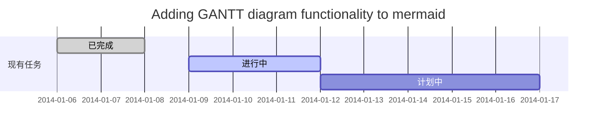
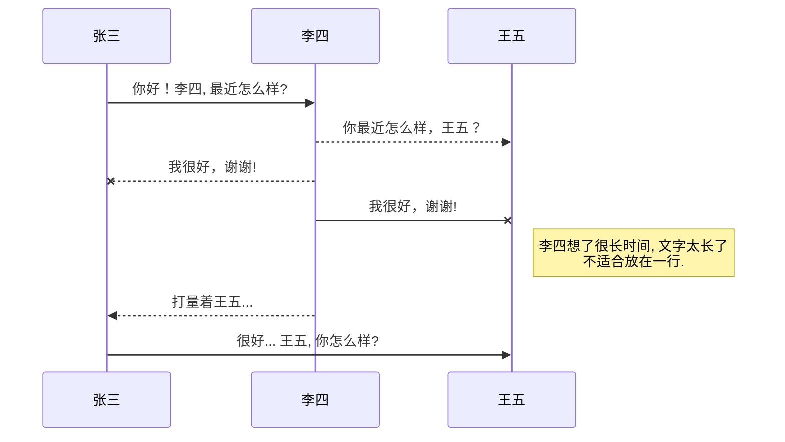
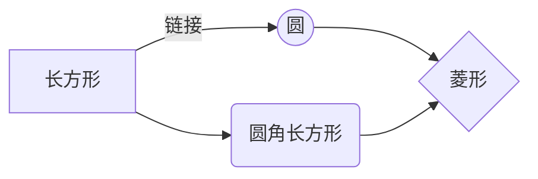

# 1、MarkDown简介
Markdown 是一种轻量级的「标记语言」，它的优点很多，目前也被越来越多的写作爱好者，撰稿者广泛使用。看到这里请不要被「标记」、「语言」所迷惑，Markdown 的语法十分简单。常用的标记符号也不超过十个，这种相对于更为复杂的 HTML 标记语言来说，Markdown 可谓是十分轻量的，学习成本也不需要太多，且一旦熟悉这种语法规则，会有一劳永逸的效果。
用markdown编写完后，我们可以导出到html发布到网站或者导出pdf保存到本地，十分的方便。最重要的是markdown源文件是纯文本文件，也就是意味着可以跨平台，使用 Markdown 的优点如下：
- 1 专注你的文字内容而不是排版样式，安心写作。
- 2 轻松的导出 HTML、PDF 和本身的 .md 文件。
- 3 纯文本内容，兼容所有的文本编辑器与字处理软件。
- 4 随时修改你的文章版本，不必像字处理软件生成若干文件版本导致混乱。
- 5 可读、直观、学习成本低。
- 6 可以做版本管理，github的默认文档就是markdown书写的。

现在很多网站都支持markdown 语法编辑文章了，比如csdn，简书等

## markdown 语法分类
最基本的Markdown，扩展的 Markdown Extra，GitHub Flavored Markdown (GFM)（可能GFM就是一种 Markdown Extra）。
基本所有的编辑器都支持前两种，第三种是github支持的语法。

# Markdown 的基本语法
## 标题
首先标题是所有文章最基本的最常用的格式，在markdown中如果某一行被定义为标题，只需要在标题前加#即可。

以下就是几个markdown
# 大标题
## 中标题
### 小标题
#### 小小标题
##### 小小标题
###### 小小标题
####### 小小标题

markdown总共支持6级标题，值得注意的是#号要和后面的内容用空格隔开

<h1>支持html语法<h1>
<div style='color:Red'>123</div>

> 不在 Markdown 涵盖范围之内的标签，都可以直接在文档里面用 HTML 撰写   
要制约的只有一些 HTML 区块元素――比如 <div\> ,<table\> 、<pre\> 、<p\> 等标签，  
必须在前后加上空行与其它内容区隔开，还要求它们的开始标签与结尾标签不能用制表符或空格来缩进。  
Markdown 的生成器有足够智能，不会在 HTML 区块标签外加上不必要的 <p\> 标签  

<table>     
    <tr>
      <td>Foo</td>
      <td>Foo</td>
      <td>Foo</td>
    </tr>
    <tr>
      <td>Foo</td>
      <td>Foo</td>
      <td>Foo</td>
    </tr>
  </table>

## 转义

> markdown中用 \\ 单斜杠进行转义

## 粗体和斜体
Markdown 的粗体和斜体也非常简单，用两个\*包含一段文本就是粗体的语法，用一个\*包含一段文本就是斜体的语法。

*Markdow*  斜体

_Markdow_ 斜体

<em>Markdow</em> 也可以用html标签标示

**Markdow**  粗体

__Markdow__ 粗体

<strong>Markdow</strong> 也可以用html标签标示

***Markdow***   斜体+粗体

## 分割线
在Markdown中分割线用--- 或者 *** 来处理
一行中用三个以上的星号、减号、底线来建立一个分隔线，行内不能有其他东西。你也可以在星号或是减号中间插入空格

--------------------------------------------------------
你好啊
******************************************************

##删除线
> 删除线使用~~来表示，~~和被删除的文字之间不能有空格

~~这是一条删除线~~

## 列表
这里的列表指的就是我们html中常用的有序列表和无序列表，及<ul\>和<ol\>.

无序列表：
*   或者 -   或者 +
*   或者 -   或者 +
*   或者 -   或者 +

* 你好
- 你好
+ 你好

这里要注意的是有使用*就都是用*号，使用 '-' 就都用 '-' 号，
混合使用会出错的。还有就是* 和内容之间要加一个空格。

有序列表比较简单，写法如下：
1. 你好
2. 你好
3. 你好

<ol>
  <li>你好</li>
  <li>你好</li>
  <li>你好</li>
</ol>

## 引用
如果你需要引用一小段别处的句子，那么就要用引用的格式。引用的语法就是在文字前面加 > ,如：

>这里是引用   
123   
qwe   
qweqwe    
qweqwe  
qweqwe  
sdsdfs

区块引用可以嵌套（例如：引用内的引用）,只要根据层次加上不同数量的 >

>12312
>>324235324
>>>123122134234
>>>>123234234234
>>123123

不同的markdown编辑器输出的显示略有不同.

引用的区块内也可以使用其他的 Markdown 语法，包括标题、列表、代码区块等

> - 1 你好啊
- 2 你不好\

##  注脚

>在需要添加注脚的文字后加上脚注名字[^注脚名字],称为加注。 然后在文本的任意位置(一般在最后)添加脚注，脚注前必须有对应的脚注名字

>注意：经测试注脚与注脚之间必须空一行，不然会失效。成功后会发现，即使你没有把注脚写在文末，经Markdown转换后，也会自动归类到文章的最后。
使用[1]表示注脚。

使用 Markdown[^1]可以效率的书写文档, 直接转换成 HTML[^2], 你可以使用 Leanote[^Le] 编辑器进行书写。

[^1]:Markdown是一种纯文本标记语言

[^2]:HyperTextMarkupLanguage超文本标记语言

[^Le]:开源笔记平台，支持Markdown和笔记直接发为博文


## 超链接

Markdown 支援两种形式的链接语法： 行内 和 参考 两种形式，两种都是使用角括号来把文字转成连结。

[百度](http://www.baidu.com)

当我们导出到html中时，就会得到一个<a>标签的输出。

如果我们要加入一张图片，其语法如下：


跟文字链接相比，也就是前面多了一个感叹号！

title 属性是选择性的，链接名称可以用字母、数字和空格，但是不分大小写：


[](http://www.baidu.com "百度")


I get 10 times more traffic from [Google][1] than from [Yahoo][2] or [MSN][3].

[1]: http://google.com/ "Google"
[2]: http://search.yahoo.com/ "Yahoo Search"
[3]: http://search.msn.com/ "MSN Search"


## 表格

markdown的表格我感觉写起来并不是那么简便，我们先来看一下表格的写法：

| Tables        | Are           | Cool  |
| ------------- |:-------------:| -----:|
| col 1     | right-aligned88888888888888888888888 | $1600 |
| col 2     | center     |   $12 |
| six       | in ok   </br>  are you ok </br>   1.你好</br>   2.你好啊</br>   3.你好不好  |    $1 |


|:------------:|这里两边加冒号就是居中，如果只有一边加冒号就是哪边对齐，如Cool那一列就是右对齐。默认左对齐。


## 代码

标记一下段代码可以用 \` (tab上面的那个) 来包含组一段代码

Use the `printf()` function.

类似的html就是 <p>Use the <code>printf()</code> function.</p>


GFM 使用三个回勾号\`\`\`

``` java
/**
 * 获取memcached的客户端 ,单例写
 * @author huanghuafeng 2011-1-19 下午03:03:11
 * @return 可用的客户端
 */
  private  static MemCachedClient getInstance(){
    MemCachedClient mc = MemCachedClientHolder.getInstance();
    if(0 == mc.stats().size()){
      MemCachedClientHolder.reloadInstance();
      mc = MemCachedClientHolder.getInstance();
      if(0 == mc.stats().size()){
        mc = null;
        MemCacheWorkBench.initClient();
        throw new MemcacheConectException("缓存服务器连接异常！");
      }
    }
    return mc;
  }
```

``` javascript
//创建监控点，卡口，区域选择中心按钮等的弹出popup
function createFeaturePopupAlarm(feature, json) {
    var popup = createCameraPopupAlarm(feature, json);
    if (popup) {
        feature.popup = popup;
        popup.feature = feature;
    }
    return popup;
}
```

``` python
def dist(a, b):
    R = 6371
    dLat = (b[0] - a[0]) * math.pi / 180
    dLon = (b[1] - a[1]) * math.pi / 180
    a = math.sin(dLat / 2) * math.sin(dLat / 2) + math.cos(b[0] * math.pi / 180) * math.cos(
        a[0] * math.pi / 180) * math.sin(dLon / 2) * math.sin(dLon / 2)
    c = 2 * math.atan2(math.sqrt(a), math.sqrt(1 - a))
    d = R * c
    return d
```


************************************************
以上是一些标准的markdown语法，除了这些语法之外，markdown 还有一些扩展的语法
********************************************************


## 注脚
---------------------------

一个具有注脚的文本。[^1]

[^1]: 注脚的解释


## LaTeX 数学公式
---------------------------

Gamma公式展示 $\Gamma(n) = (n-1)!\quad\forall
n\in\mathbb N$ 是通过 Euler integral

$$
\Gamma(z) = \int_0^\infty t^{z-1}e^{-t}dt\,.
$$


## 插入甘特图
---------------------------




## 插入UML图
------------


## 插入Mermaid流程图


## 插入Flowchart流程图
```mermaid
flowchat
st=>start: Start:>https://www.zybuluo.com
io=>inputoutput: verification
op=>operation: Your Operation
cond=>condition: Yes or No?
sub=>subroutine: Your Subroutine
e=>end
st->io->op->cond
cond(yes)->e
cond(no)->sub->io
```

## 常用的编辑器

>常用的Markdown 编辑器  
* OSX  
VSCode  
Atom  
Byword  
Mou  
Typora  
MacDown  
RStudio
* Linux  
VSCode   
Atom  
Typora  
ReText  
UberWriter  
RStudio  
* Windows  
VSCode  
Atom  
CuteMarkEd  
MarkdownPad2  
Miu
Typora  
RStudio
* iOS
Byword  
* 浏览器插件     
MaDo (Chrome)  
Marxico（Chrome） 
